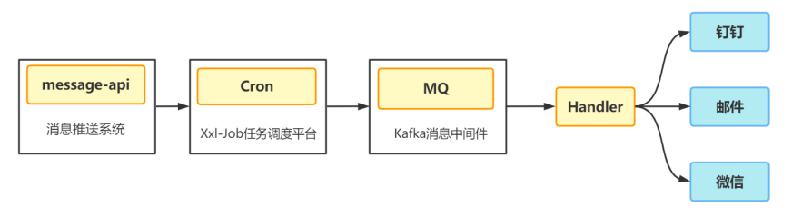
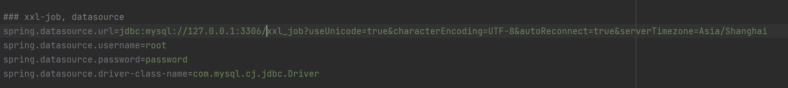
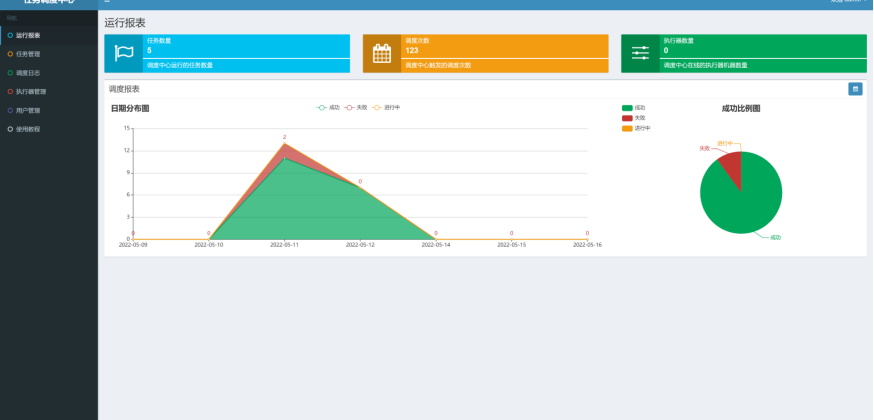
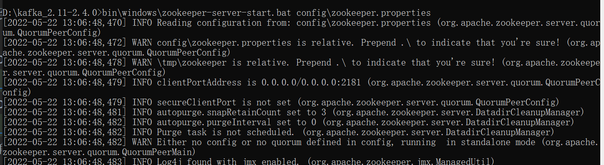

# message

#### 介绍
多通道消息推送，支持钉钉群聊机器人，微信公众号，qq邮件

#### 软件架构

软件架构说明

#### 部署教程
1. MySql
   
   运行send_msg.sql数据库脚本
   修改application.properties配置文件数据库连接配置
   
1.  Xxl-job部署

拉去项目到本地：git clone https://gitee.com/xuxueli0323/xxl-job.git

打开doc，找到sql文件，在mysql中运行该脚本文件 tables_xxl_job.sql

打开xxl-job-admin，修改port和数据库配置改为自己的配置

运行xxl-job-admin,调度中心访问地址：http://localhost:{port}/xxl-job-admin,账号admin，密码123456，进入调度中心

2.  kafka单机部署
    
下载 http://kafka.apache.org/downloads

cmd进入文件内，启动zookeeper ： bin\windows\zookeeper-server-start.bat config\zookeeper.properties

启动kafka ：bin\windows\kafka-server-start.bat config\server.properties

关闭命令行

bin\windows\kafka-server-stop.bat config\server.properties

bin\windows\zookeeper-server-stop.bat config\zookeeper.properties
